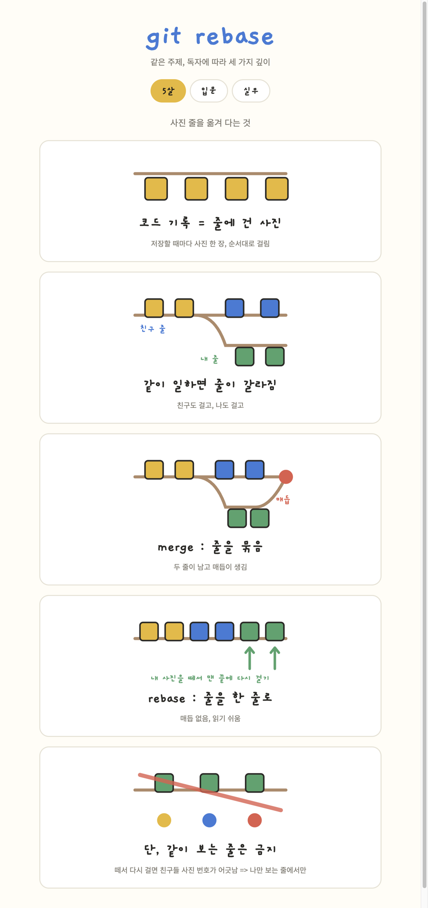

# modak-skills

모닥불 공방에서 쓰는 Agent Skill 모음이다.
Claude Code를 비롯한 코딩 에이전트에서 바로 설치해 사용할 수 있다.

## 설치

Claude Code 마켓플레이스로 설치한다.

```
/plugin marketplace add modakbul-gongbang/modak-skills
/plugin install modak-skills@modak-skills
```

스킬 파일을 직접 복사해도 된다.

```bash
git clone https://github.com/modakbul-gongbang/modak-skills.git
cp -r modak-skills/eli ~/.claude/skills/
```

## 스킬 목록

| 스킬 이름 | 하는 일 | 호출 방법 | 문서 |
| --- | --- | --- | --- |
| `eli` | 주제를 5살, 입문, 실무 세 수준으로 나눠 그림 위주의 HTML 설명 자료를 만든다 | `/eli [5\|입문\|실무] <주제>` | [사용 가이드](eli/instruction.md) |

### eli 결과물 예시

`/eli git rebase`를 실행하면 5살, 입문, 실무 세 수준이 탭으로 묶인 페이지가 만들어진다.
아래는 그중 5살 탭이다. 입문과 실무 탭은 [사용 가이드](eli/instruction.md#예시-결과물)에서 볼 수 있다.



## 폴더 구조

```
modak-skills/
├── .claude-plugin/
│   ├── marketplace.json   # 마켓플레이스 정의
│   └── plugin.json        # 플러그인이 포함하는 스킬 목록
└── <스킬 이름>/
    ├── SKILL.md           # 에이전트가 읽는 지침
    ├── skill.json         # 스킬 메타데이터
    └── instruction.md     # 사람이 읽는 사용 문서
```

## 스킬 추가하기

기여 방법은 [CONTRIBUTING.md](CONTRIBUTING.md)에 정리해 두었다.

## 라이선스

MIT
