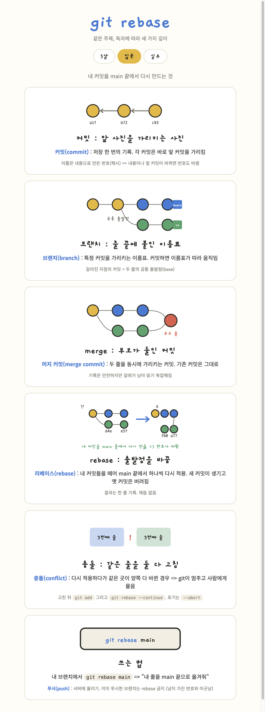
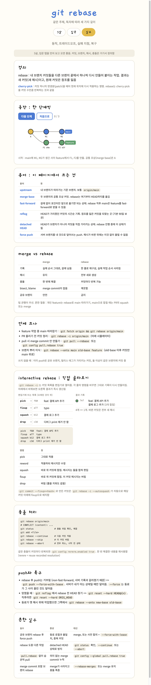

# eli

## 이 스킬이 하는 일

하나의 주제를 독자 수준에 맞춰 설명하는 HTML 아티팩트를 만든다.

- 수준은 나이가 아니라 독자를 기준으로 나눈다. `5살`, `입문`, `실무` 세 단계이다.
- 수준을 지정하지 않으면 세 단계를 탭으로 묶은 한 페이지를 만들고, `5살` 탭을 기본으로 선택한다.
- 설명의 중심은 글이 아니라 그림이다. 인라인 SVG나 CSS 도형으로 큰 그림을 그리고, 카드 하나에 개념 하나만 담는다.
- 기본 언어는 한국어이고, 제목은 명사구, 본문은 `~함 / ~됨 / ~임`으로 끝낸다.

## 언제 쓰나

- `/eli 5 트랜스포머`
- `/eli 실무 git rebase -i`
- "이거 5살한테 설명하듯 알려줘"
- "입문자용으로 그림 있는 설명 자료 만들어줘"

## 사용법

```
/eli [5|입문|실무] <주제>
```

첫 토큰이 수준이고, 나머지가 주제이다.

| 토큰 | 탭 이름 | 독자 |
| --- | --- | --- |
| `5`, `5살` | 5살 | 주제를 처음 듣는 사람 |
| `20`, `입문` | 입문 | 막 배우기 시작한 사람 |
| `30`, `실무` | 실무 | 업무에서 사용하는 사람 |

수준을 여러 개 적거나(`5 20 30`) 아예 생략하면 탭 페이지가 만들어진다.
그 밖의 숫자는 가장 가까운 수준으로 대응된다. 5~12는 `5살`, 13~25는 `입문`, 26 이상은 `실무`이다.

## 예시 결과물

`/eli git rebase`로 만든 페이지이다. 수준을 지정하지 않았기 때문에 세 수준이 탭으로 묶였다.
같은 주제를 다루지만 비유, 용어, 다루는 깊이가 탭마다 달라진다.

<details open>
<summary><b>5살</b> — 사진 줄을 옮겨 다는 것</summary>

카드 5장이고 용어가 하나도 없다. 커밋은 줄에 걸린 사진, 브랜치는 갈라진 줄로 그린다.


</details>

<details>
<summary><b>입문</b> — 내 커밋을 main 끝에서 다시 만드는 것</summary>

카드마다 용어를 하나씩 `한글(English) : 뜻` 형식으로 정의한다. 커밋, 브랜치, 머지 커밋 순서로 쌓아 올린다.



</details>

<details>
<summary><b>실무</b> — 동작, 트레이드오프, 실패 지점, 복구</summary>

단계별로 넘겨 보는 위젯, interactive rebase 시뮬레이터, merge와 rebase 비교표, 충돌 처리와 복구 명령이 들어간다.
용어표는 그림 뒤에 놓인다.



</details>

## 주제 종류에 따른 전개 순서

주제를 먼저 분류한 다음 카드 순서를 정한다. 애매하면 도구로 간주한다.

| 종류 | 예 | 카드 순서 |
| --- | --- | --- |
| 개념 | 해시, 브랜치, DNS, 캐시 | 정의 => 작동 원리 => 예시 |
| 도구, 명령어 | `rebase -i`, `grep`, `docker run` | 없을 때의 불편 => 명령어 => 화면 전후 => 쓰지 말아야 할 때 |
| 절차, 워크플로 | PR 흐름, 배포, 온보딩 | 단계 목록 => 각 단계의 입력과 출력 => 사람들이 막히는 지점 |

도구를 다룰 때는 정의로 시작하지 않는다. "이게 없으면 이렇게 됨"으로 열고 실제 로그나 에러 화면을 보여준다.

## 결과물

Artifact 도구로 발행한다. 제목은 주제를 명사구로 적는다.
파비콘은 5살이 🖍️, 입문이 📘, 실무가 🧭, 탭 페이지가 🎚️이다.

## 필요한 것

Claude Code의 Artifact 도구와 `artifact-design` 스킬을 사용한다. 별도의 API 키나 외부 의존성은 없다.
